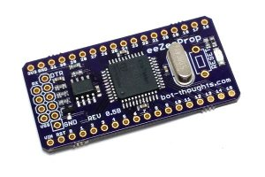
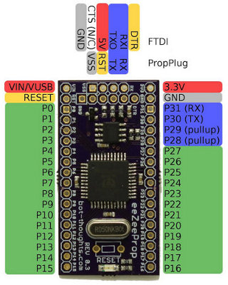

# eeZeeProp User Guide


## Introduction

The Parallax Propeller is an amazing, flexible, innovative MCU with 8 cogs running in parallel. The eeZeeProp breakout brings all this power to the breadboard. The board includes onboard regulator, eeprom, power LED, crystal---everything you need and nothing you don't. Plus you can program it either with an FTDI programmer *or* Prop Plug programmer.

Want one? [Buy on Tindie](https://tindie.com/shops/bot_thoughts/eezee-propeller/)

**NOTE:** If you have an older, Rev 0.2 board, see [the Rev 0.2 documentation](eeZeePropRev2.md)

## Pinout



## How to Assemble

### Pin Headers

* Install the two 18-pin headers on a breakout board, 9 rows apart.
* Place the eeZeeProp, Propeller side up, on the pin headers.
* Solder the pin headers.

### Switch

* Remove the eeZeeProp from the breadboard.
* Install the switch and bend the pins if necessary to hold it in place.
* Solder the switch from the bottom and then, optionally, from the top.

### Programming header

* Provided are two 6-pin headers, one right angle, one vertical.
* If you're going to use both FTDI and Prop Plug, use the right angle header for Prop Plug.
* To use either with FTDI, install. To use either with the Prop Plug, break off two pins.
* Install the header(s) and carefully hold in place at the RX/DTR side, and don't touch the other side.
* Solder *only* the ```GND``` or ```VSS``` pin, opposite your finger.
* Check vertical alignment of the pin header and adjust while re-soldering the ```GND``` or ```VSS``` pin.
* Once aligned, solder the remaining pins.

## Getting Started

### Examples, Help, Community

* [Propeller Documentation](http://www.parallaxsemiconductor.com/docs)
* [Resource Index](https://forums.parallax.com/discussion/111166/propeller-resource-index) on Propeller 1 Forums
* Lots of smart people willing to help on the [Parallax Propeller 1 Forum](https://forums.parallax.com/categories/propeller-1-multicore-microcontroller)
* Find example programs in the [examples](../examples) directory of this repo.
* Useful objects can be found on the [OBEX](http://obex.parallax.com/) (Propeller Object Exchange)

### IDE

The following are IDEs that I recommend for Propeller programming:

  * [PropellerIDE](https://github.com/parallaxinc/PropellerIDE) for Spin/PASM development
  * [SimpleIDE](http://learn.parallax.com/propeller-c-set-simpleide) and [PropGCC](http://code.google.com/p/propgcc/) for writing in C

### Chip Programming

You can either use a 5V FTDI, 3.3V FTDI or Prop Plug to program your eeZee Prop (see *Power Options* below). Pay careful attention to the pin labels. For FTDI, the pins are labeled ```DTR``` (aka GRN aka Green) and ```GND``` (aka BLK aka Black). For Prop Plug the pins are labeled ```RX``` and ```VSS```.

Other serial adapters can be made to work, you just need a programmer with DTR, RX, TX, and GND.

  * Vcc -> (opt) tie to power, or see Power below
  * RXI -> tie to receive (prop out, pc in)
  * TXO -> tie to transmit (prop in, pc out)
  * DTR -> this resets the prop
  * GND -> ground

## Powering the Board

The eeZeeProp provides lots of flexibility. You can power from FTDI, from an external source, or an external 3.3V source. If you are using a 3.3V FTDI, connect the ```3V3FTDI``` solder jumper.

You can still use the FTDI even if the board is powered externally, because Schottky diodes prevent current flowing from one supply (FTDI or VIN) back into the other.

### Limits

```VIN``` Pin input voltage: 4.8V-6.0V @ 800mA; 4.7V-6.0V @ 100mA, room temperature. Lower input voltages are typically possible but not guaranteed in all scenarios.

Higher input voltages are acceptable on boards of Rev 0.4 and newer. The onboard regulator is either an STM LD1117-33 ([datasheet.pdf](http://www.st.com/web/en/resource/technical/document/datasheet/CD00000544.pdf)), or OnSemi NCP1117 ([datasheet.pdf](http://www.onsemi.com/pub_link/Collateral/NCP1117-D.PDF)) and can support higher voltages, but you'll need to be careful of temperatures and load current.

### Solder Jumpers

 * ```3V3FTDI``` is used when you have a FTDI programmer supplying 3.3V (rather than 5V).
 * ```BYPASS``` bypasses the VIN Schottky diode; power on FTDI appears on VIN.

### Keep It Simple

Use a 5V FTDI and leave ```BYPASS``` and ```3V3FTDI``` disconnected. If you are using a 3.3V FTDI, connect the ```3V3FTDI``` solder jumper and leave ```BYPASS``` disconnected.  In either case you can optionally add an external power supply to VIN.

### Advanced Options

| BYPASS       | 3V3FTDI      | VIN pin             | 3V3 pin     | 5V FTDI | 3.3V FTDI |
|--------------|--------------|---------------------|-------------|---------|-----------|
| Disconnected | Disconnected | External Supply ok. | 3.3V Output | Ok      | NO        |
| Disconnected | Connected    | External Supply ok. | 3.3V Output | NO      | Ok        |
| Connected    | Disconnected | OUTPUT ONLY, 5V     | 3.3V Output | Ok      | NO        |
| Connected    | Connected    | OUTPUT ONLY, 3.3V   | 3.3V Output | NO      | Ok        |

Note: with ```BYPASS``` soldered, the ```VIN``` pin becomes output *only* and cannot be used as voltage input without potentially damaging the FTDI.

## BOE

BOE is Brown-Out Enable, which causes a shutdown/reset when power falls below a certain level. To enable it, connect the ```BOE``` solder jumper to the ```GND``` side.  To disable, connect ```BOE``` to the ```VCC``` side.
